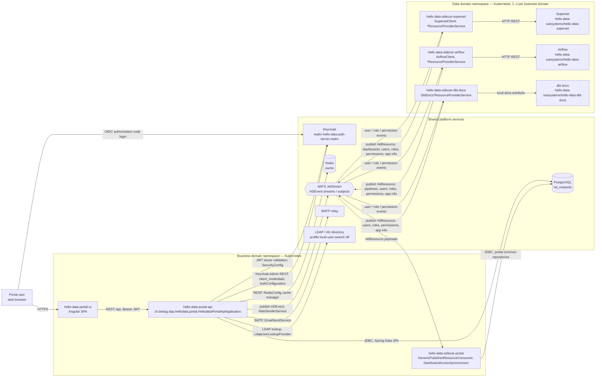

# 01 — Context and Overview

## Purpose of this document set

`docs/arc42/` is the architecture frame for the HelloDATA BE repository: a small, code-anchored set of chapters that
describes *how the system is built* — its context, building blocks, runtime behaviour and cross-cutting concerns — with
every claim traceable to a module, class or configuration key that actually exists in this repository.

It is deliberately **not** a second copy of the product documentation. The conceptual and operational documentation
already lives in `docs/docs/` and remains authoritative for it:

- [Architecture](../docs/architecture/architecture.md) — business/data domain model, module view, NATS and Keycloak concepts, building block view.
- [Data stack](../docs/architecture/data-stack.md) — the dbt / Airflow / Superset stack and how the data layers relate.
- [Infrastructure](../docs/architecture/infrastructure.md) — Kubernetes namespaces, storage, deployment platforms, K8s jobs.

Where those chapters explain *what* and *why*, the arc42 chapters here point at *where in the code* it is realised.
Anything named in this chapter exists in the repository outline; anything that does not yet exist is marked `(planned)`.

This is chapter (a) of the frame. The remaining arc42 chapters (building blocks, runtime view, deployment view,
cross-cutting concepts, decisions, quality requirements) are **(planned)** — only this file exists today.

## System context

The portal API is the control plane. Users reach it through the Angular SPA; Keycloak issues the tokens it validates;
PostgreSQL and Redis hold its state and caches; NATS JetStream is the only channel between the portal and the subsystem
sidecars, which in turn drive Superset, Airflow and the dbt docs subsystem.

Notes on the diagram:

- Namespace boundaries follow the deployment model in [Infrastructure](../docs/architecture/infrastructure.md): a business
  domain is a Kubernetes namespace, and data domains are deployed alongside it. The repository contains **no Kubernetes API
  client** — namespace and endpoint names are deployment-time configuration (`hello-data.*`, `spring.*` keys), not code.
- Keycloak, PostgreSQL, Redis and NATS are drawn as shared platform services because the repository only configures their
  endpoints; which namespace they are scheduled into is a deployment decision.
- The Superset, Airflow and dbt-docs sidecars are the ones named by this chapter. The repository also contains
  `hello-data-sidecar-cloudbeaver`, `hello-data-sidecar-jupyterhub` and `hello-data-sidecar-sftpgo`, which follow the same
  publish/consume pattern over NATS.

## External systems

| External system | Role in the context | Protocol | Repository class / module |
| --- | --- | --- | --- |
| Angular portal UI | Human-facing client of the portal API; NgRx state, route-driven permission guards | HTTPS / REST + JSON, Bearer JWT | `hello-data-portal/hello-data-portal-ui` |
| Keycloak (login / token issuance) | Identity provider; issues the JWTs the API validates as an OAuth2 resource server | OIDC / OAuth 2.0 over HTTPS | `ch.bedag.dap.hellodata.portal.base.config.SecurityConfig`, `KeycloakLogoutHandler` |
| Keycloak (admin) | User/realm administration performed by the portal (create, disable, sync users) | Keycloak Admin REST, `client_credentials` grant | `ch.bedag.dap.hellodata.portal.user.conf.AuthConfiguration`, `KeycloakUserSyncService` |
| PostgreSQL | Portal and metainfo persistence (`hd_metainfo`); users, roles, dashboard access, queries, storage monitoring | JDBC (`org.postgresql.Driver`, HikariCP) | Spring Data JPA repositories in `hello-data-commons/hello-data-portal-common/.../repository` |
| Redis | Cache manager for `users_with_dashboards` and `subsystem_users`, with per-cache TTLs | RESP via Spring Data Redis | `ch.bedag.dap.hellodata.portal.base.config.RedisConfig` |
| NATS JetStream | Event bus between portal, portal sidecar and subsystem sidecars; carries `HDEvent` and `HdResource` payloads | NATS / JetStream (`nats.spring.server`) | `ch.bedag.dap.hellodata.commons.nats.NatsConfiguration`, `ch.bedag.dap.hellodata.commons.nats.service.NatsSenderService`, `@JetStreamSubscribe` consumers |
| Superset | Dashboards, charts, datasets of a data domain; users and roles kept in sync from portal events | HTTP REST | `hello-data-sidecars/hello-data-sidecar-superset` — `SupersetClient`, `SupersetClientProvider`, `*ResourceProviderService`, `Superset*Consumer` |
| Airflow | Pipeline/DAG orchestration of a data domain; users, roles and pipeline state exchanged with the portal | HTTP REST | `hello-data-sidecars/hello-data-sidecar-airflow` — `AirflowClient`, `AirflowApiRequestBuilder`, `Airflow*ResourceProviderService` |
| dbt docs | Lineage/documentation subsystem of a data domain; app info, users, roles and permissions published to the portal | NATS publish of `HdResource`; docs served by the subsystem | `hello-data-sidecars/hello-data-sidecar-dbt-docs` — `DbtDocs*ResourceProviderService`; subsystem `hello-data-subsystems/hello-data-dbt-docs` |
| SMTP relay | Outgoing portal notifications and invitations | SMTP (STARTTLS, `spring.mail.*`) | `ch.bedag.dap.hellodata.portal.email.service.EmailSendService`, `EmailNotificationService` |
| LDAP / Active Directory | Optional user lookup when the local user-search profile is not active | LDAP (`hello-data.ldap.*`) | `ch.bedag.dap.hellodata.portal.user.service.ldap.LdapUserLookupProvider`, `LdapConfig`, `LdapConfigProperties` |
| Kubernetes API | Namespace/workload topology the components are deployed into | — | Not accessed from repository code; see [Infrastructure](../docs/architecture/infrastructure.md) |
| Central monitoring / logging (Grafana, Prometheus, ELK) | Platform observability; the API exposes `info`, `health`, `prometheus` actuator endpoints | HTTP scrape of `/api/actuator/prometheus` | Actuator configuration in `hello-data-portal-api/src/main/resources/application.yml`; dashboards/collectors are **(planned)** in this repository |

## Related spec chapters

The `docs/spec/` tree does not exist in the repository yet — **every** link below is to a **(planned)** chapter and will
resolve only once that chapter is added:

- [Authentication and authorization spec](../spec/01-authentication-and-authorization.md) — **(planned)**; contract behind `SecurityConfig` and `AuthConfiguration`.
- [Event contracts spec](../spec/02-event-contracts.md) — **(planned)**; `HDEvent` / `HdResource` payloads exchanged over NATS JetStream.
- [Portal persistence spec](../spec/03-portal-persistence.md) — **(planned)**; entities and repositories in `hello-data-portal-common`.
- [Sidecar integration spec](../spec/04-sidecar-integration.md) — **(planned)**; publish/consume responsibilities per sidecar module.
- [Configuration and deployment spec](../spec/05-configuration-and-deployment.md) — **(planned)**; required `hello-data.*` and `spring.*` keys per module.