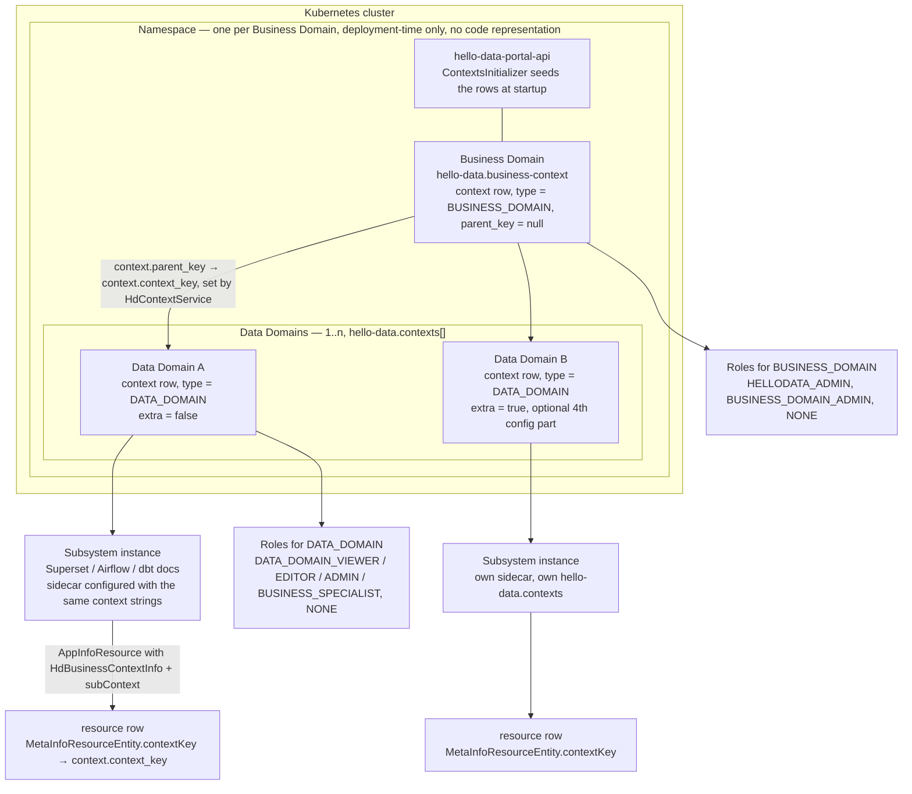

# 02 — Tenancy Model

Chapter (b) of the architecture frame. Chapter (a) is [01 — Context and Overview](./01-context-and-overview.md); the
conceptual description of business and data domains lives in [Architecture](../docs/architecture/architecture.md) and the
namespace/deployment view in [Infrastructure](../docs/architecture/infrastructure.md). This chapter does not repeat them —
it states how the tenancy model is *actually realised in code*, naming only types that exist in the repository.

## The model as built

```text
Business Domain  →  Kubernetes namespace  →  portal tenant  →  1..n Data Domains
```

- A **Business Domain** is the tenant. Exactly one is configured per portal deployment (`hello-data.business-context`,
  a single `@NotNull` string), so one running `hello-data-portal-api` serves exactly one tenant.
- The **Kubernetes namespace** is the deployment-time realisation of that tenant. It is *not* modelled in code: the
  repository contains no Kubernetes API client, and namespace names never appear as a persisted attribute. Multi-tenancy
  across tenants is achieved by deploying the whole stack again into another namespace.
- The **portal tenant** is the row set in the `context` table: one `BUSINESS_DOMAIN` row plus the `DATA_DOMAIN` rows.
- A **Data Domain** is a configured context (`hello-data.contexts[n]`), 1..n per business domain, each optionally flagged
  `extra`.



## How it materialises in code

### 1. Configuration binding — `HelloDataContextConfig`

`ch.bedag.dap.hellodata.commons.sidecars.context.HelloDataContextConfig` is a `@Validated`
`@ConfigurationProperties("hello-data")` bean in `hello-data-commons/hello-data-sidecar-common`. It holds two raw
properties and parses them on demand:

- `businessContext` — a single `@NotNull` string, pipe-delimited: `type | key | name`.
- `contexts` — a `List<String>`, each entry `type | key | name` with an optional fourth part `extra` (boolean).

Members:

- `validateProperties()` — annotated `@PostConstruct`, so it runs at bean creation and fails startup fast. It requires the
  business context to split into **exactly 3** parts and each configured context into **3 or 4** parts, throwing
  `IllegalArgumentException` with the offending string otherwise. It also logs each validated context.
- `getBusinessContext()` — splits and trims the business context into a `BusinessContext` (`type`, `key`, `name`).
- `getContext()` — returns the **first** configured context as a `Context`, or `null` when `contexts` is empty. This is
  what a single-data-domain sidecar uses to describe itself.
- `getContexts()` — returns all configured contexts as `List<Context>`, or an empty list when unset.

Nested types:

- `HelloDataContextConfig.BusinessContext` — `@Data`, implements `HdContext`; fields `type`, `key`, `name`.
- `HelloDataContextConfig.Context` — extends `BusinessContext`, adds the `extra` flag parsed from the optional 4th part.

`ch.bedag.dap.hellodata.commons.sidecars.context.HdContext` is the minimal contract behind both: `getType()`,
`getName()`, `getKey()`.

The bean is registered explicitly per application, e.g. `ch.bedag.dap.hellodata.portal.base.config.ConfigurationProperties`
for the portal and `@EnableConfigurationProperties({..., HelloDataContextConfig.class})` on `HDSidecarSuperset`,
`HDSidecarAirflow`, `HDSidecarDbtDocs`, `HdSidecarCloudbeaver`, `HDSidecarJupyterhub`, `HDSidecarSftpGo` and
`HdJupyterhubGateway`. Every participant therefore reads the *same* pipe-delimited grammar.

### 2. Type resolution — `HdContextType`

`ch.bedag.dap.hellodata.commons.sidecars.context.HdContextType` is the enum with three constants and a human-readable
`typeName`: `BUSINESS_DOMAIN("Business Domain")`, `DATA_DOMAIN("Data Domain")`, `MODULE("Module")`.

`HdContextType.findByTypeName(String)` maps the first pipe-separated part of a configuration string onto the enum and
throws a `RuntimeException` when no constant matches — this is the single point where free-text configuration becomes a
typed concept. Note: the `MODULE` constant is declared but no code path in the repository currently persists a context of
that type; treat module-level contexts as **(planned)**.

### 3. Persistence — `HdContextEntity` and `HdContextRepository`

`ch.bedag.dap.hellodata.commons.metainfomodel.entity.HdContextEntity` (`@Entity(name = "context")`, `@Table(name =
"context")`, extending `BaseEntity`) is the persisted form:

- `name`
- `contextKey` — `@NaturalId`, unique, column `context_key`; the stable identifier used everywhere else
- `parentContextKey` — column `parent_key`, FK to `context.context_key` (changelog `13_update_hd_context_table.xml`)
- `type` — `HdContextType` persisted `@Enumerated(EnumType.STRING)`
- `extra` — documented in the entity as "used mostly for extra Data Domain"

`ch.bedag.dap.hellodata.commons.metainfomodel.repository.HdContextRepository` (a `JpaRepository<HdContextEntity, UUID>`)
is the only access path: `getByContextKey`, `getByType`, `getByTypeAndName`, `getByTypeAndNameAndKey`,
`findAllByTypeIn`, `findAllByContextKeyIn`, `existsByContextKeyAndType`. Callers such as
`ch.bedag.dap.hellodata.portal.role.service.RoleService` enumerate data domains with
`findAllByTypeIn(List.of(HdContextType.DATA_DOMAIN))` — the domain list is always read back from the table, never from
configuration at request time.

### 4. Startup seeding — `ContextsInitializer`

`ch.bedag.dap.hellodata.portal.initialize.service.ContextsInitializer` turns configuration into rows.
`ch.bedag.dap.hellodata.portal.initialize.service.Initializer` (a `CommandLineRunner`) calls `initContexts()` **first**,
before `RolesInitializer` and user initialisation, and `RolesInitializer.initContextRoles()` refuses to proceed
(`ContextsNotFetchedYetException`, retried in a loop) while the `context` table is still empty.

`initContexts()` runs in `Propagation.REQUIRES_NEW` and:

1. reads `helloDataContextConfig.getBusinessContext()` and saves it,
2. iterates `helloDataContextConfig.getContexts()` and saves each, passing through `isExtra()`.

`saveContext(...)` resolves the type with `HdContextType.findByTypeName(...)` and issues a native
`INSERT INTO context (...) VALUES (...) ON CONFLICT (context_key) DO NOTHING` with `created_by`/`modified_by` set to
`'system'`. Seeding is therefore idempotent and never overwrites an existing row — and it does **not** set `parent_key`.

The parent link is established later by `ch.bedag.dap.hellodata.sidecars.portal.service.context.HdContextService`
(`hello-data-sidecar-portal`): subsystem sidecars publish an `AppInfoResource` carrying an
`ch.bedag.dap.hellodata.commons.sidecars.context.HdBusinessContextInfo` whose `subContext` is the sidecar's own data
domain (built in each `*AppInfoResourceProviderService` from `getBusinessContext()` and `getContext()`).
`PublishedAppInfoResourcesConsumer` hands it to `saveBusinessContext(...)`, whose `findOrCreateContext(...)` upserts the
business domain, then the data domain with `parentContextKey` pointing at the business domain, and updates `parent_key`
or `extra` on an existing row when they differ. Both sides of that exchange are still driven by static configuration —
the sidecar is only echoing its own `hello-data.*` properties.

### 5. Role scoping — `HdRoleName.getByContextType`

`ch.bedag.dap.hellodata.commons.sidecars.context.role.HdRoleName` binds each role constant to the context type it is
valid for: `HELLODATA_ADMIN` and `BUSINESS_DOMAIN_ADMIN` → `BUSINESS_DOMAIN`; `DATA_DOMAIN_VIEWER`,
`DATA_DOMAIN_EDITOR`, `DATA_DOMAIN_ADMIN`, `DATA_DOMAIN_BUSINESS_SPECIALIST` → `DATA_DOMAIN`; `NONE` has no context type.

`HdRoleName.getByContextType(HdContextType)` returns every role whose `contextType` matches, **plus `NONE`** — so "no
role in this context" is always an assignable outcome. Consumers:

- `RolesInitializer.initContextRoles()` persists one `RoleEntity` per `HdRoleName`, copying `roleEnum.getContextType()`
  into `RoleEntity.contextType`, and warns when an existing row's context type has drifted.
- `RolesInitializer.initContextRolesToUsers()` grants the default admin `HELLODATA_ADMIN` on the business domain and
  `DATA_DOMAIN_ADMIN` on all data domains via `RoleService`; every other user starts at `NONE` in every context.
- `RolesInitializer.initDefaultUserAsSuperuser()` writes a `UserPortalRoleEntity` with
  `contextType = BUSINESS_DOMAIN` and `contextKey = helloDataContextConfig.getBusinessContext().getKey()`.
- `ch.bedag.dap.hellodata.portal.csv.service.CsvParserService` validates bulk-assignment rows with `getByContextType`,
  rejecting a role name that does not belong to the target context type.

A user's effective grants are `UserContextRoleEntity` rows (`user`, `role`, `contextKey`), i.e. a role is always held
*within one context key*, never globally. The authorization semantics themselves stay in
[Roles / Authorization Concept](../docs/manuals/role-authorization-concept.md).

## Term → property → entity → owner

| Conceptual term | Configuration property | Persisted as | Code owner |
| --- | --- | --- | --- |
| Business Domain (tenant) | `hello-data.business-context` = `Business Domain \| <key> \| <name>` | `context` row, `type = BUSINESS_DOMAIN`, `parent_key = null` | `HelloDataContextConfig.getBusinessContext()` → `ContextsInitializer.initContexts()` |
| Data Domain | `hello-data.contexts[n]` = `Data Domain \| <key> \| <name>[ \| <extra>]` (env `HELLO_DATA_CONTEXTS_0`, …) | `context` row, `type = DATA_DOMAIN`, `parent_key` → business domain | `HelloDataContextConfig.getContexts()` → `ContextsInitializer`; `parent_key` by `HdContextService.saveBusinessContext(...)` |
| "Extra" Data Domain | optional 4th part of `hello-data.contexts[n]` | `context.extra = true` | `HelloDataContextConfig.Context.isExtra()`, `HdContextEntity.extra` |
| Context type | first part of either string, matched against `HdContextType.getTypeName()` | `context.type` (`@Enumerated(EnumType.STRING)`) | `HdContextType.findByTypeName(...)` |
| Context key (join key) | second part of either string | `context.context_key` (`@NaturalId`, unique) | `HdContextEntity.contextKey`, `HdContextRepository.getByContextKey(...)` |
| Single data domain of a sidecar | first entry of `hello-data.contexts` | carried as `HdBusinessContextInfo.subContext` on published resources | `HelloDataContextConfig.getContext()`, `*AppInfoResourceProviderService` |
| Subsystem instance in a data domain | `hello-data.instance.name`, `hello-data.instance.url` | `resource` row, `MetaInfoResourceEntity.contextKey` → `context.context_key` | `AppInfoResourceProviderService` (per sidecar) → `PublishedAppInfoResourcesConsumer` |
| Role valid in a context type | — (enum-driven, not configurable) | `role` row, `RoleEntity.contextType` | `HdRoleName`, `HdRoleName.getByContextType(...)`, `RolesInitializer.initContextRoles()` |
| User's role in one context | — (assigned at runtime) | `user_context_role` row (`UserContextRoleEntity.contextKey`), `user_portal_role` row | `RoleService`, `RolesInitializer.initContextRolesToUsers()` |
| Kubernetes namespace | deployment manifests / Compose files, not a `hello-data.*` property | not persisted | none — no Kubernetes client in the repository; see [Infrastructure](../docs/architecture/infrastructure.md) |
| Module context | — | `HdContextType.MODULE` exists but is never written | **(planned)** — no code path persists it today |

## Domain provisioning is static

**Domain provisioning in this repository is static: configuration-driven and resolved at startup.** Concretely:

- The business domain and its data domains come from `hello-data.business-context` and `hello-data.contexts`, validated
  in `validateProperties()` at bean creation and written once by `ContextsInitializer.initContexts()` during the
  `Initializer` `CommandLineRunner`.
- No REST controller, service or event consumer in the portal creates or deletes an `HdContextEntity` at runtime. The
  only two writers are `ContextsInitializer` (startup, config) and `HdContextService` (echoing a sidecar's own static
  configuration off the app-info event); both use `ON CONFLICT (context_key) DO NOTHING`, so they are idempotent and
  additive.
- Adding a data domain therefore means changing configuration and restarting — plus deploying the corresponding
  subsystem and sidecar — not calling an API. Removing one is not implemented at all.
- Consequence for readers of the code: treat the context table as effectively immutable within a process lifetime, and
  always resolve domains through `HdContextRepository`, never by re-parsing configuration.

The rationale, alternatives and consequences of this choice belong in the ADR chapter:
[09 — Architecture Decisions](./09-architecture-decisions.md) — **(planned)**; the decision record for static,
configuration-driven domain provisioning is to be written there, and this chapter should link to it once it exists.

## Related spec chapters

The `docs/spec/` tree does not exist in the repository yet — **every** link below is to a **(planned)** chapter and will
resolve only once that chapter is added:

- [Authentication and authorization spec](../spec/01-authentication-and-authorization.md) — **(planned)**; how context-scoped roles become portal permissions.
- [Event contracts spec](../spec/02-event-contracts.md) — **(planned)**; `HdBusinessContextInfo` and `UserContextRoleUpdate` payloads that carry context keys.
- [Portal persistence spec](../spec/03-portal-persistence.md) — **(planned)**; the `context`, `role`, `user_context_role` and `user_portal_role` tables.
- [Sidecar integration spec](../spec/04-sidecar-integration.md) — **(planned)**; per-sidecar context configuration and app-info publication.
- [Configuration and deployment spec](../spec/05-configuration-and-deployment.md) — **(planned)**; the `hello-data.business-context` / `hello-data.contexts` grammar and its environment-variable form.