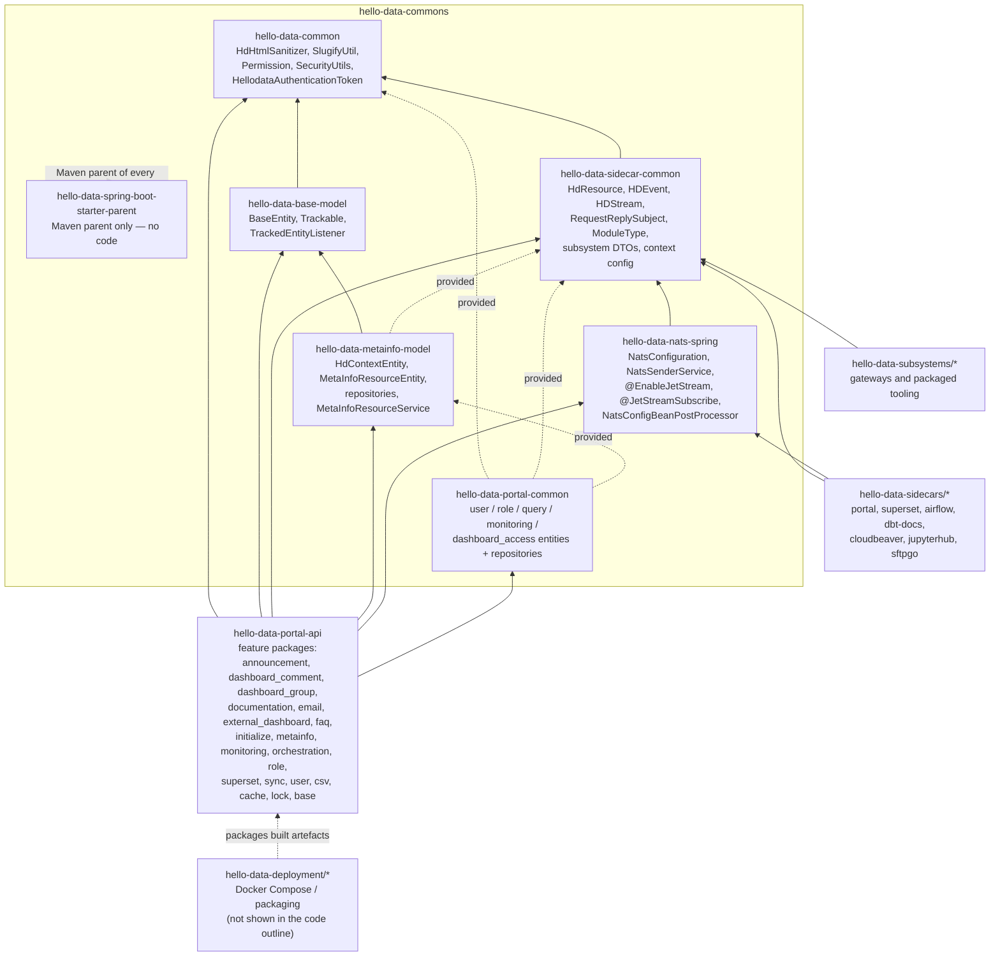

# 03 — Module Breakdown

Chapter (c) of the architecture frame. Chapter (a) is [01 — Context and Overview](./01-context-and-overview.md), chapter (b)
is [02 — Tenancy Model](./02-tenancy-model.md). Where [Architecture](../docs/architecture/architecture.md) explains the
platform concepts, this chapter states **which Maven module owns which kind of code**, in which direction dependencies are
allowed to point, and where a new class belongs. Everything named below exists in the repository; anything that does not is
marked **(planned)**.

## Top-level layout

The root `pom.xml` (`ch.bedag.dap.hellodata:hello-data`, packaging `pom`, Java 21) aggregates five modules:

| Aggregator | Contains | Role |
| --- | --- | --- |
| `hello-data-commons` | `hello-data-spring-boot-starter-parent`, `hello-data-common`, `hello-data-base-model`, `hello-data-sidecar-common`, `hello-data-metainfo-model`, `hello-data-nats-spring`, `hello-data-portal-common` | Shared libraries. No runnable application. |
| `hello-data-portal` | `hello-data-portal-api`, `hello-data-portal-ui`, `hello-data-portal-ui-e2e` | The control plane: Spring Boot backend, Angular SPA, Cypress E2E. |
| `hello-data-sidecars` | `hello-data-sidecar-portal`, `-superset`, `-airflow`, `-dbt-docs`, `-cloudbeaver`, `-jupyterhub`, `-sftpgo` | Event-driven adapters between NATS and one external tool each. |
| `hello-data-subsystems` | `hello-data-superset`, `-airflow`, `-dbt-docs`, `-cloudbeaver`, `-cloudbeaver-gateway`, `-jupyterhub-gateway`, `-monitoring-storage`, `-cleanup-logs` | Packaged/wrapped tooling and gateways in front of it. |
| `hello-data-deployment` | `hello-data-dc-portal`, `-keycloak`, `-postgres`, `-superset`, `-airflow`, `-cloudbeaver`, `hello-data-showcase` | Deployment packaging — see [Deployment module](#deployment-module) below. |

`hello-data-spring-boot-starter-parent` is the shared Maven parent of every backend module and is authoritative for Java
version, dependency management, Surefire defaults and JaCoCo. It contains build configuration only — never application code.

## The rings, innermost first

The commons modules form a layered stack. Each ring may only reach inwards; the direction is enforced by the POMs, not by
convention alone.

### Ring 0 — `hello-data-commons/hello-data-common`

Package `ch.bedag.dap.hellodata.commons`. The only module with **no dependency on another HelloDATA module** — it depends on
`spring-security-core` and `jsoup` and nothing else of ours. It is the floor of the stack, so anything placed here becomes
visible to every other module.

- `HdHtmlSanitizer` — `@UtilityClass`; `sanitizeHtml(String)` cleans user-supplied HTML with a Jsoup `Safelist.relaxed()`
  policy extended by `span`/`p`/`li` and with `script`, `iframe`, `object` removed. Returns `""` for `null`.
- `SlugifyUtil` — `@UtilityClass`; `slugify(...)` normalises/deaccents names into role-safe slugs, plus the shared role-name
  constants `BI_ADMIN`, `BI_VIEWER`, `BI_EDITOR`, `Admin` and the `D_` dashboard-role prefix.
- `security.Permission` — the enum of portal permissions (`USER_MANAGEMENT`, `ROLE_MANAGEMENT`, `DASHBOARDS`,
  `DASHBOARD_ACCESS`, `MONITORING`, `WORKSPACES`, `DASHBOARD_GROUPS_MANAGEMENT`, …). The vocabulary behind `@PreAuthorize`.
- `security.HellodataAuthenticationToken` — the authentication object the portal puts into the `SecurityContext`, carrying
  user id, e-mail, name, superuser flag and the resolved permission set.
- `security.SecurityUtils` — `@UtilityClass` reading the current `SecurityContextHolder`: `getCurrentUsername()` (falls back
  to `"SYSTEM"`), `getCurrentUserId()`, `getCurrentUserEmail()`, `getCurrentUserFullName()`, `getCurrentUserPermissions()`,
  `isSuperuser()`.

**Belongs here:** framework-light utilities and the security vocabulary shared by *all* runtimes. **Does not belong here:**
JPA entities, NATS types, anything portal-specific.

### Ring 1a — `hello-data-commons/hello-data-base-model`

Package `ch.badag.dap.hellodata.commons.basemodel` (note the `badag` spelling — that is the package as it exists in the
repository; do not "fix" it in imports without a deliberate refactor). Depends on `hello-data-common`.

- `BaseEntity` — `@MappedSuperclass`, `@EntityListeners(TrackedEntityListener.class)`, implements `Trackable, Serializable`.
  Holds `@Id UUID id`, `createdDate`, `createdBy`, `modifiedDate`, `modifiedBy`, plus Hibernate-proxy-safe `equals`/`hashCode`.
- `Trackable` — the interface the listener works against (id + audit accessors).
- `TrackedEntityListener` — `@PrePersist` assigns a random `UUID` when absent and stamps `createdBy`/`createdDate` from
  `SecurityUtils.getCurrentUsername()`; `@PreUpdate` stamps `modifiedBy`/`modifiedDate`. Non-`Trackable` entities are rejected.

**Belongs here:** the persistence base class and its audit mechanics — nothing domain-specific.

### Ring 1b — `hello-data-commons/hello-data-sidecar-common`

Package `ch.bedag.dap.hellodata.commons.sidecars`. Depends on `hello-data-common`. This is the **contract module**: every
payload that crosses the NATS boundary is defined here, so a change here is a wire-format change affecting portal *and* every
sidecar simultaneously.

- `resources.v1.HdResource` — the polymorphic root interface (`@JsonTypeInfo` on the `kind` property) with subtypes
  `AppInfoResource`, `DashboardResource`, `UserResource`, `RoleResource`, `PermissionResource`, `PipelineResource`.
  Members: `getApiVersion()`, `getModuleType()`, `getKind()`, `getInstanceName()`, `getData()`, `getSummary()`.
- `events.HDEvent` — the enum binding each event to `(HDStream, subject, payload class)`, e.g.
  `PUBLISH_APP_INFO_RESOURCES` → `publish_resources.app_info` → `AppInfoResource`, plus `CREATE_USER`, `DISABLE_USER`,
  `UPDATE_USER_CONTEXT_ROLE`, `SYNC_USERS`, `UPDATE_STORAGE_MONITORING_RESULT`, `PUBLISH_DASHBOARD_COMMENTS`, …
- `events.HDStream` — the JetStream stream names; today a single constant, `METAINFO_STREAM`.
- `events.RequestReplySubject` — subjects for the request/reply pattern: `UPDATE_DASHBOARD_ROLES_FOR_USER`,
  `UPLOAD_DASHBOARDS_FILE`, `GET_QUERY_LIST`, `GET_DASHBOARD_ACCESS_LIST`, `VALIDATE_DASHBOARD_POINTERS`,
  `NATS_CONNECTION_HEALTH_CHECK`.
- `modules.ModuleType` / `modules.ModuleResourceKind` — the subsystem taxonomy (`SUPERSET`, `AIRFLOW`, `DBT_DOCS`,
  `CLOUDBEAVER`, `JUPYTERHUB`, `SFTPGO`) and the `kind` string constants used as Jackson type ids.
- Subsystem DTOs under `resources.v1.user.data` and friends — `SubsystemUser`, `SubsystemRole`, `SubsystemUserUpdate`,
  `SubsystemUserDelete`, `SubsystemGetAllUsers`, `UserContextRoleUpdate`, `AllUsersContextRoleUpdate`, `UserCacheUpdate`,
  `ModuleRoleNames`; storage DTOs `StorageMonitoringResult`, `StorageSize`, `DatabaseSize`; dashboard DTOs
  `DashboardUpload`, `PublishedComment`, `DashboardCommentsPublished`, `DashboardPointerValidationRequest`/`-Response`;
  Superset response shapes under `resources/v1/**/response/superset`.
- `context.*` — `HelloDataContextConfig`, `HdContext`, `HdContextType`, `HdBusinessContextInfo`, `role.HdRoleName`
  (described in detail in [02 — Tenancy Model](./02-tenancy-model.md)).

**Belongs here:** anything both sides of a NATS subject must agree on. **Does not belong here:** JPA annotations, Spring web
controllers, tool-specific HTTP clients.

### Ring 2a — `hello-data-commons/hello-data-metainfo-model`

Package `ch.bedag.dap.hellodata.commons.metainfomodel`. Depends on `hello-data-base-model` (compile) and
`hello-data-sidecar-common` (provided). The persistence of *platform* metadata, shared by portal and portal sidecar.

- `entity.HdContextEntity` — `@Entity(name = "context")`; `contextKey` is the `@NaturalId`, `parentContextKey` the
  self-referencing link, `type` an `HdContextType`, plus the `extra` flag.
- `entity.MetaInfoResourceEntity` — `@Entity(name = "resource")`; `apiVersion`, `moduleType`, `kind`, `instanceName`,
  `contextKey`, and the received `HdResource` stored verbatim as a JSON column (`@JdbcTypeCode(SqlTypes.JSON)`).
- `repository.HdContextRepository`, `repository.ResourceRepository` — the Spring Data access paths.
- `service.MetaInfoResourceService` — `@Service`/`@Transactional(readOnly = true)` read model over `resource`, unwrapping the
  JSON column back into typed `HdResource` subclasses: `findAll()`, `findAllByModuleType`, `findAllByModuleTypeAndKind(...)`,
  `findAllByModuleTypeAndKindAndContextKey(...)`, `findAllByKindWithContext(...)`.

**Belongs here:** context and published-resource persistence used by more than one runtime.

### Ring 2b — `hello-data-commons/hello-data-nats-spring`

Package `ch.bedag.dap.hellodata.commons.nats`. Depends on `hello-data-sidecar-common` plus `io.nats:jnats` and
`io.nats:nats-spring`. This is the **only** module that knows the NATS client API; every other module talks in `HDEvent`s.

- `NatsConfiguration` — `@Configuration extends NatsAutoConfiguration implements AsyncConfigurer, ConnectionListener`; logs
  connection lifecycle events, and declares the `NatsConfigBeanPostProcessor`, the fallback `ObjectMapper` (JSR-310 module)
  and the `NatsHealthIndicator` beans.
- `annotation.@EnableJetStream` — type-level annotation that `@Import`s `NatsConfiguration`; the opt-in switch each
  application puts on a configuration class.
- `annotation.@JetStreamSubscribe` — method-level, `@Transactional`, carrying `event()`, `timeoutMinutes()` (default 5) and
  `asyncRun()` (default true). The declarative consumer contract.
- `bean.NatsConfigBeanPostProcessor` — `BeanPostProcessor, DisposableBean`; scans every bean for `@JetStreamSubscribe`
  methods, sizes a fixed thread pool from the number of `HDEvent` constants, and honours `hello-data.on-error.kill-jvm` /
  `-counter` and `hello-data.instance.name`.
- `bean.SubscribeAnnotationThread`, `bean.BeanMethodWrapper` — the per-subscription consumer thread and the reflective
  invocation wrapper it drives.
- `service.NatsSenderService` — `publishMessageToJetStream(HDEvent, T body)`; validates the body against
  `HDEvent.getDataClass()`, refuses to publish when the connection is not `CONNECTED`, ensures the stream via
  `NatsStreamUtil` and publishes with an idempotency message id. Failures surface as `NatsException`.
- `util.NatsStreamUtil` — `createOrUpdateStream(...)` stream/subject provisioning.
- `actuator.NatsHealthIndicator` — exposes connection state through Spring Boot actuator.
- `exception.NatsException`, `listener.NatsListener` — error type and connection listener plumbing.

**Belongs here:** JetStream plumbing. **Does not belong here:** the definition of an event or its payload — that is
`hello-data-sidecar-common`.

### Ring 3 — `hello-data-commons/hello-data-portal-common`

Package `ch.bedag.dap.hellodata.portalcommon`. Depends (all `provided`) on `hello-data-common`, `hello-data-sidecar-common`
and `hello-data-metainfo-model`. Organised by feature, each with `entity` and `repository` subpackages. It is shared by
`hello-data-portal-api` and `hello-data-sidecar-portal` — which is exactly why these tables live here and not in the API.

| Feature package | Entities | Repositories |
| --- | --- | --- |
| `user` | `UserEntity`, `DefaultUserEntity`, `Permissions` | `UserRepository`, `DefaultUserRepository` |
| `role` | `RoleEntity`, `PortalRoleEntity`, `SystemDefaultPortalRoleName`, `relation.UserContextRoleEntity`, `relation.UserPortalRoleEntity` | `RoleRepository`, `PortalRoleRepository`, `UserContextRoleRepository`, `UserPortalRoleRepository` |
| `query` | `QueryEntity` | `QueryRepository` |
| `monitoring` | `StorageSizeEntity` | `StorageSizeRepository` |
| `dashboard_access` | `DashboardAccessEntity` | `DashboardAccessRepository` |

**Belongs here:** a portal table that at least two runtimes read or write. **Does not belong here:** an entity only
`hello-data-portal-api` touches — that stays in its own feature package (see below), and both `AnnouncementEntity` and
`DashboardCommentEntity` are examples of the latter.

### Ring 4 — `hello-data-portal/hello-data-portal-api`

Package `ch.bedag.dap.hellodata.portal`. Depends on **all** commons modules. The single Spring Boot application of the
control plane; `HellodataPortalApiApplication` is annotated `@SpringBootApplication(scanBasePackages = "ch.bedag.dap.hellodata")`
and `@EnableScheduling`, and `base.config.PersistenceConfig` widens `@EntityScan`/`@EnableJpaRepositories` to the same root —
which is how the `commons` entities, repositories and `@Service` beans reach the context. Keep that root package intact.

Code is organised **by feature first**, each feature holding some of `controller`, `service`, `data` (DTOs), `entity`,
`repository`, `event`, `mapper`, `conf`/`config`, `util`:

| Feature package | Owns |
| --- | --- |
| `announcement` | Portal-wide announcements: `AnnouncementController`, `AnnouncementService`, `AnnouncementEntity`, `AnnouncementRepository`, create/update DTOs. |
| `dashboard_comment` | Comment threads on dashboards: comment/permission/domain controllers, `DashboardCommentService`, `-PermissionService`, `-NotificationService`, `DashboardCommentDwhSyncService`, `DashboardCommentReconciliationJob`, `DashboardCommentMapper`, comment/version/permission entities, export/import DTOs, `DashboardCommentSyncProperties`. |
| `dashboard_group` | Grouping of dashboards and their members: `DashboardGroupController`, `DashboardGroupService`, `DashboardGroupEntity` with `DashboardGroupEntry`/`DashboardGroupUserEntry`, `DashboardGroupRepository`. |
| `documentation` | Domain documentation: `SummaryController`, `DocumentationService`, `DocumentationEntity`, `DocumentationRepository`. |
| `email` | Outgoing mail: `EmailSendService`, `EmailNotificationService`, `TemplateService`, `EmailTemplate`, `EmailTemplateData`, `EmailTemplateModelKeys`. No controller — it is a downstream service of other features. |
| `external_dashboard` | Dashboards hosted outside Superset: `ExternalDashboardController`, `ExternalDashboardService`, `ExternalDashboardEntity`, `ExternalDashboardRepository`. |
| `faq` | FAQ entries incl. input validation: `FaqController`, `FaqService`, `FaqEntity`, `FaqRepository`, `@NoBase64Images` + `NoBase64ImagesValidator`. |
| `initialize` | Startup sequencing: `Initializer` (`CommandLineRunner`), `ContextsInitializer`, `RolesInitializer`, `DefaultUserInitializer`, `ExampleUsersInitializer`, `UsernameInitializer`, `UserSelectedDashboardInitializer`, `DashboardCommentSyncInitializer`, `MigrationService`/`MigrationEntity`, `InitializationCompletedEvent`. |
| `metainfo` | Read side over `MetaInfoResourceService`: `MetaInfoResourceController`, `MetaInfoUsersService`, subsystem/user/dashboard result DTOs. |
| `monitoring` | Storage monitoring: `MonitoringController`, `StorageSizeService`, storage/database size DTOs. |
| `orchestration` | Airflow pipelines: `PipelineController`, `OrchestrationService`, `PipelineDto`, `PipelineInstanceDto`. |
| `role` | Context roles and portal roles: `RoleController`, `PortalRoleController`, `RoleService`, `PortalRoleService`, role DTOs. |
| `superset` | Superset-facing portal logic: `SupersetController`, `DashboardService`, `DashboardAccessService`, `QueryService`, `DashboardMetadataEntity`, `DashboardMetadataRepository`, dashboard/query DTOs. |
| `sync` | User synchronisation runs and their locking: `UsersSyncController`, `UsersSyncService`, `UserSyncLockEntity`, `UserSyncStatus`, `UserSyncLockRepository`. |
| `user` | The largest feature: `UserController`; `UserService`, `KeycloakService`, `KeycloakUserSyncService`, `KeycloakLogoutHandler`, `AutoProvisionService`, `BulkAssignmentService`, `BatchUsersInvitationService`, `UserRoleSyncService`, `UserDashboardSyncService`, `UserSubsystemSyncService`, `UserSelectedDashboardService`; the `UserLookupProvider` SPI with `local.LocalUserLookupProvider` and `ldap.LdapUserLookupProvider` behind `UserLookupProviderManager`; `conf.AuthConfiguration`, `DefaultAdminProperties`, `ExampleUsersProperties`; `event.*` sync events and `UserSyncEventListener`. |
| `csv` | Bulk import/export: `CsvParserService`, `BatchExportService`, `BatchExportScheduler`, `CsvUserRole`. |
| `cache` | `CacheUpdateService` — cache invalidation driven by portal/subsystem changes. |
| `lock` | `AdvisoryLockService` — PostgreSQL advisory locks guarding single-runner jobs. |
| `base` | Cross-feature wiring only: `base.config.SecurityConfig`, `RedisConfig`, `PersistenceConfig`, `JetStreamConfig`, `JacksonConfiguration`, `SwaggerConfig`, `I18nConfig`, `AsynchronousSpringEventsConfig`, `EmailNotificationConfig`, `ConfigurationProperties`, `SystemProperties`, `HellodataGitInfoContributor`, `LocalDateTimeToMillisSerializer`; `base.auth.HellodataAuthenticationConverter`; `base.util.PageUtil`. |

`base` is deliberately thin: it holds wiring, not behaviour. Business logic that "feels generic" still belongs to the feature
that owns the data.

## Module dependency diagram

Arrows point **towards the dependency**; dotted arrows are `provided`-scope or non-code relationships. There are no cycles,
and nothing in `hello-data-commons` points at `hello-data-portal`, `hello-data-sidecars` or `hello-data-subsystems`.

## Dependency-direction rules

| Module | May depend on | Must never depend on | Evidence |
| --- | --- | --- | --- |
| `hello-data-common` | nothing of ours (third-party only: Spring Security core, jsoup) | every other HelloDATA module | its POM declares no `ch.bedag.dap.hellodata` dependency |
| `hello-data-base-model` | `hello-data-common` | `sidecar-common`, `metainfo-model`, `nats-spring`, `portal-common`, portal, sidecars, subsystems | `TrackedEntityListener` uses only `SecurityUtils` |
| `hello-data-sidecar-common` | `hello-data-common` | `base-model`, `metainfo-model`, `nats-spring`, `portal-common`, portal, sidecars, subsystems | contract module — must stay persistence- and transport-free |
| `hello-data-metainfo-model` | `hello-data-base-model`, `hello-data-sidecar-common` (provided), `hello-data-common` (transitive) | `nats-spring`, `portal-common`, portal, sidecars, subsystems | `MetaInfoResourceEntity` stores an `HdResource`; it never publishes one |
| `hello-data-nats-spring` | `hello-data-sidecar-common`, `hello-data-common` (transitive) | `base-model`, `metainfo-model`, `portal-common`, portal, sidecars, subsystems | it transports `HDEvent`s; it must not know a table |
| `hello-data-portal-common` | `hello-data-common`, `hello-data-sidecar-common`, `hello-data-metainfo-model` (all provided) | `nats-spring`, portal, sidecars, subsystems | it is shared by `portal-api` **and** `sidecar-portal`, so it may not depend on either |
| `hello-data-portal-api` | every `hello-data-commons` module | `hello-data-sidecars/*`, `hello-data-subsystems/*`, `hello-data-deployment/*` | it reaches sidecars only over NATS, never by Maven |
| `hello-data-sidecars/*` | `hello-data-sidecar-common`, `hello-data-nats-spring` (+ `portal-common`/`metainfo-model` for `sidecar-portal`) | `hello-data-portal-api`, another sidecar | each sidecar owns exactly one tool |
| `hello-data-subsystems/*` | `hello-data-sidecar-common` where a shared type is needed | `hello-data-portal-api`, `hello-data-sidecars/*` | gateways wrap a tool; they do not orchestrate the platform |
| `hello-data-deployment/*` | built artefacts of the modules above | source of any module | packaging only |

Two rules follow from the table and are worth stating separately:

1. **The portal and a sidecar never share a Maven dependency edge.** Everything they exchange is an `HDEvent` payload defined
   in `hello-data-sidecar-common`. If a feature seems to need a direct call, it needs an event contract instead.
2. **`hello-data-sidecar-common` changes are wire-format changes.** Adding a field is additive; renaming or removing one
   breaks every deployed sidecar until it is redeployed.

## Where do I put a new X?

- **A new REST endpoint** → `hello-data-portal-api/.../portal/<feature>/controller`, with `@PreAuthorize` naming a
  `Permission` constant. If the feature package does not exist yet, create it — do not add to `base`.
- **New portal business logic** → `portal/<feature>/service`, constructor-injected (`@RequiredArgsConstructor`), transactional
  where it writes, `ResponseStatusException` for HTTP-facing failures.
- **A request/response DTO** → `portal/<feature>/data`. It stays inside `portal-api`; it must not leak into commons.
- **A table only the portal API uses** → `portal/<feature>/entity` + `repository` in `portal-api`, extending `BaseEntity`
  (as `AnnouncementEntity` and `DashboardCommentEntity` do), plus a Liquibase changelog.
- **A table the portal API *and* the portal sidecar both use** → `hello-data-portal-common/.../<feature>/{entity,repository}`.
- **A table describing contexts or published subsystem resources** → `hello-data-metainfo-model`.
- **A new event** → add the constant to `HDEvent` in `hello-data-sidecar-common` with its stream, subject and payload class;
  publish with `NatsSenderService.publishMessageToJetStream(...)`, consume with `@JetStreamSubscribe`.
- **A new event payload / subsystem DTO** → `hello-data-sidecar-common` under `resources/v1/...`; register it as a
  `@JsonSubTypes.Type` on `HdResource` if it is a resource kind.
- **A new NATS mechanism** (stream option, subscription behaviour, health signal) → `hello-data-nats-spring` only.
- **A new permission** → the `Permission` enum in `hello-data-common`, then reference it from `@PreAuthorize` and from the
  UI's `requiredPermissions` route data.
- **A shared, framework-light helper** → `hello-data-common` — but only if more than one module genuinely needs it; otherwise
  keep it in the feature that uses it.
- **Audit/id behaviour for entities** → nowhere new: extend `BaseEntity` and let `TrackedEntityListener` do it.
- **A new integration with an external tool** → a module under `hello-data-sidecars/`, never a new package inside
  `portal-api`.
- **Cross-cutting Spring wiring** (security, cache, serialisation, scheduling) → `portal/base/config`. Nothing else belongs
  in `base`.
- **A second `@SpringBootApplication`** → never. The portal application class stays in `ch.bedag.dap.hellodata.portal` with
  `scanBasePackages = "ch.bedag.dap.hellodata"`; moving or duplicating it hides the commons beans from the scan.

## Deployment module

`hello-data-deployment/*` is the deployment module — **(not shown in the code outline — described only at the level the repo
evidences, uncertain claims marked as planned)**. What the repository does evidence:

- `hello-data-deployment/pom.xml` is a `pom`-packaging aggregator (`ch.bedag.dap.hellodata:hello-data-deployment`) listing
  `hello-data-dc-cloudbeaver`, `hello-data-dc-keycloak`, `hello-data-dc-portal`, `hello-data-dc-postgres`,
  `hello-data-dc-airflow`, `hello-data-dc-superset` and `hello-data-showcase`.
- The `dc-` prefix and the description in `.github/copilot-instructions.md` identify these as Docker Compose / packaging
  modules for local and demo environments.
- The aggregator pins `maven.compiler.source/target` to 17 rather than inheriting the root's Java 21 — the only place in the
  build where that differs.

Beyond that, the concrete Compose topology, image tags and volume layout are **(planned)** content for this chapter; the
authoritative deployment view today is [Infrastructure](../docs/architecture/infrastructure.md). No Kubernetes manifests and
no Kubernetes API client exist in the repository, so anything namespace-level is deployment configuration, not code.

## Related spec chapters

The `docs/spec/` tree does not exist in the repository yet — **every** link below is to a **(planned)** chapter and will
resolve only once that chapter is added:

- [Authentication and authorization spec](../spec/01-authentication-and-authorization.md) — **(planned)**; the `Permission` vocabulary, `HellodataAuthenticationToken` and `@PreAuthorize` contract owned by `hello-data-common` and `portal/base`.
- [Event contracts spec](../spec/02-event-contracts.md) — **(planned)**; the `HDEvent` / `HDStream` / `RequestReplySubject` / `HdResource` surface owned by `hello-data-sidecar-common`.
- [Portal persistence spec](../spec/03-portal-persistence.md) — **(planned)**; the split between `hello-data-portal-common`, `hello-data-metainfo-model` and feature-local entities in `hello-data-portal-api`.
- [Sidecar integration spec](../spec/04-sidecar-integration.md) — **(planned)**; how `hello-data-nats-spring` plumbing is consumed per sidecar module.
- [Configuration and deployment spec](../spec/05-configuration-and-deployment.md) — **(planned)**; per-module `hello-data.*` / `spring.*` keys and the `hello-data-deployment/*` packaging.