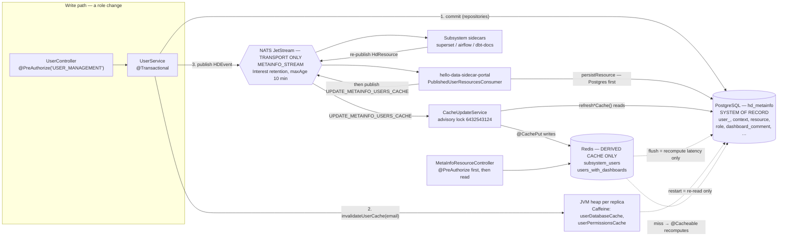

# 05 — State Ownership

Chapter (e) of the architecture frame. Chapter (a) is [01 — Context and Overview](./01-context-and-overview.md), chapter (b)
is [02 — Tenancy Model](./02-tenancy-model.md), chapter (c) is [03 — Module Breakdown](./03-module-breakdown.md), chapter (d)
is [04 — Identity and Authorization](./04-identity-and-authorization.md).

This chapter answers one question: **for any piece of state in the platform, which store owns it?** It names the stores the
portal actually talks to, fixes the rule for each, and spells out the operational consequences of those rules — above all the
one that makes the rest testable: **a full Redis flush must be harmless**. Everything named below exists in the repository;
anything that does not is marked **(planned)**. No credential values appear here — configuration is referenced by property
name only.

## Scope: what this chapter owns, and what it does not

| Concern | Owner | Where |
| --- | --- | --- |
| Which store is authoritative for which state | **this chapter** | `spring.datasource`, `RedisConfig`, `HDStream.METAINFO_STREAM` |
| The rule that a cache hit is never authoritative | **this chapter** | `MetaInfoUsersService`, `HellodataAuthenticationConverter` |
| Cache rebuild paths and their cost | **this chapter** | `refreshSubsystemUsersCache()`, `refreshDashboardUsersCache()`, `CacheUpdateService` |
| Safety of multi-replica startup rebuilds | **this chapter** | `AdvisoryLockService`, `UsersSyncService`, `CacheUpdateService` |
| Table shapes, columns, changelogs | portal persistence spec | `db/changelog/db.changelog-master.yaml` and `changelogs/*.xml` |
| Wire format of each event payload | event contracts spec | `hello-data-sidecar-common`, `HDEvent` |
| Who may call a cache-clearing endpoint | [04 — Identity and Authorization](./04-identity-and-authorization.md) | `@PreAuthorize` on `MetaInfoResourceController` |
| Where an entity's Java code belongs | [03 — Module Breakdown](./03-module-breakdown.md) | `portal-common` / `metainfo-model` / feature package |
| Why a given ownership rule was chosen over alternatives | [09 — Architecture Decisions](./09-architecture-decisions.md) — **(planned)** | ADR records |

## The rules table

The whole chapter compresses into this. Everything after it is evidence and consequence.

| Store | What may live there | What must never live there | How it is rebuilt |
| --- | --- | --- | --- |
| **PostgreSQL** (`hd_metainfo`) | All portal state of record: users, roles and assignments, contexts, published subsystem resources, dashboard metadata and comments, announcements, FAQ, storage figures, sync/migration markers | Anything that is purely a rendering optimisation and can be recomputed for free | It is not "rebuilt". Schema comes from Liquibase (`db.changelog-master.yaml`); seed rows from the `Initializer` chain; data loss is restored from backup |
| **Redis** | Derived, recomputable aggregates only — today exactly `subsystem_users` and `users_with_dashboards` | Any value that is the only copy of a fact; any authorization decision; any write that has not already been committed to Postgres | Automatically: `@Cacheable` miss recomputes from Postgres. Eagerly: `@CachePut` from `CacheUpdateService` on `UPDATE_METAINFO_USERS_CACHE`, or the two `clear-cache` endpoints |
| **NATS JetStream** | Messages in flight between the portal and sidecars (`HDEvent` payloads, request/reply subjects) | Any state expected to survive; any history intended to be replayed later; any "queue as a table" pattern | It is not rebuilt. Producers re-publish: sidecars re-emit `HdResource`s, the portal re-emits via `SYNC_USERS` from `UserSubsystemSyncService` / `UsersSyncService` |
| **JVM heap** (Caffeine, per replica) | `HellodataAuthenticationConverter.userDatabaseCache` / `userPermissionsCache` — the caller's `UserDto` and permission names | Anything another replica must also see; anything whose staleness changes a security outcome beyond the TTL | Dropped on restart; invalidated per e-mail via `invalidateUserCache(String)`; recomputed from Postgres on the next request |
| **Keycloak** | Credentials, the login session, the `sub` identity | Portal roles, permissions, context assignments — those are portal state | Reconciled from Postgres by `KeycloakUserSyncService` and `DefaultUserInitializer`; the portal never treats a JWT claim as a permission source |
| **Subsystem stores** (Superset, Airflow, …) | The subsystem's own internal state | The portal's view of it — that is the `resource` table | The portal re-publishes user/role events; each sidecar reapplies them against its tool |

Two corollaries follow directly and are worth stating on their own:

1. **Every write completes in Postgres before anything else is told about it.** A cache put or an event publish is an
   *announcement* of a committed fact, never the fact itself.
2. **Losing any store other than Postgres costs time, not data.** That is the property the rest of this chapter defends.

## 1. PostgreSQL — the system of record

The portal API binds a single datasource (`spring.datasource.url`, default `jdbc:postgresql://localhost:5432/hd_metainfo`,
HikariCP pool, `spring.jpa.hibernate.ddl-auto: none`). Schema changes are Liquibase changesets under
`src/main/resources/db/changelog/`, never Hibernate DDL — which is itself a statement of ownership: the schema is a reviewed
artefact, not a side effect of the entity classes.

Persistent state is JPA entities plus Spring Data repositories. Most extend the shared base class
`ch.badag.dap.hellodata.commons.basemodel.BaseEntity` (`@MappedSuperclass`, `@EntityListeners(TrackedEntityListener.class)`),
which supplies the `UUID id` and the `createdBy` / `createdDate` / `modifiedBy` / `modifiedDate` audit columns.

> Note on the package name: the base-model package is spelled `ch.badag.dap.hellodata.commons.basemodel` in the repository —
> `badag`, not `bedag`. That typo is load-bearing in every import; see [03 — Module Breakdown](./03-module-breakdown.md).
> Do not "fix" it in passing.

Representative owners, and the module each lives in:

| State | Entity | Repository | Module |
| --- | --- | --- | --- |
| Portal users | `UserEntity` (extends `BaseEntity`) | `UserRepository` | `hello-data-portal-common` |
| Business/data domain contexts | `HdContextEntity` (extends `BaseEntity`) | `HdContextRepository` | `hello-data-metainfo-model` |
| Published subsystem resources | `MetaInfoResourceEntity` (extends `BaseEntity`) | `ResourceRepository` | `hello-data-metainfo-model` |
| Role definitions and assignments | `RoleEntity`, `PortalRoleEntity`, `UserContextRoleEntity`, `UserPortalRoleEntity` | the matching `*Repository` types | `hello-data-portal-common` |
| Dashboard comments | `DashboardCommentEntity`, `DashboardCommentVersionEntity`, `DashboardCommentPermissionEntity` | `DashboardCommentRepository`, … | `hello-data-portal-api` |
| Sync and migration markers | `UserSyncLockEntity`, `MigrationEntity`, `DefaultUserEntity`, `ExampleUsersCreatedEntity` | the matching `*Repository` types | `portal-api` / `portal-common` |

**Correction to the ticket text, so the rule is stated against the code as it is:** `DashboardCommentEntity` and
`DashboardCommentVersionEntity` do **not** extend `BaseEntity`. `DashboardCommentEntity` is a plain
`@Entity @Table(name = "dashboard_comment")` with its own `@Id String id` (length 36), epoch-millis `createdDate` /
`deletedDate` `Long` columns, and an `entityVersion` counter; `DashboardCommentRepository` is a
`JpaRepository<DashboardCommentEntity, String>`. `DashboardCommentPermissionEntity` *does* extend `BaseEntity`. This changes
nothing about ownership — comments are Postgres state of record either way — but "extends `BaseEntity`" is not the test for
whether something is owned by Postgres. **The test is: is this the only copy of the fact?**

### Two shades of "record"

The `resource` and `context` tables deserve a distinction that is easy to blur:

- **Portal-owned state** — users, roles, assignments, comments, announcements, FAQ, dashboard metadata. The portal is the
  origin. Nothing upstream can regenerate it. Losing it is data loss.
- **Projected state** — `MetaInfoResourceEntity` rows. The origin is the subsystem; the sidecar publishes an `HdResource`
  over NATS and `GenericPublishedResourceConsumer.persistResource(...)` writes it down. It is a *materialised projection*,
  recoverable by asking every sidecar to re-publish.

Both are read as authoritative by the portal, because a projection in Postgres is durable and a projection in Redis is not.
The difference matters only for recovery planning: the `resource` table can be rebuilt from the subsystems; the `user_` and
`user_context_role` tables cannot be rebuilt from anywhere.

## 2. Redis — a derived cache, and nothing else

`hello-data-portal-api` depends on `spring-boot-starter-data-redis` and connects via `spring.data.redis.host` /
`spring.data.redis.port`. The **only** thing it uses Redis for is the Spring Cache abstraction:
`ch.bedag.dap.hellodata.portal.base.config.RedisConfig` is `@Configuration @EnableCaching` and declares a single
`cacheManager(RedisConnectionFactory)` bean — a `RedisCacheManager` with `StringRedisSerializer` keys and a
`GenericJacksonJsonRedisSerializer` for values (default typing under an `@class` property, so cached DTO lists round-trip).

There is no `RedisTemplate` anywhere in the repository, no Spring Session, and no Redis-based distributed lock. **Everything
in Redis arrives through a `@Cacheable` / `@CachePut` annotation and can be deleted by a `@CacheEvict` or a `FLUSHALL`.**
Keep it that way: introducing a direct `RedisTemplate` write is the exact move this chapter exists to prevent, because it
creates a fact whose only copy is in a cache.

Two caches are configured by name:

| Cache constant | Redis cache name | Holds | TTL property (`application.yml` value) |
| --- | --- | --- | --- |
| `RedisConfig.SUBSYSTEM_USERS_CACHE` | `subsystem_users` | `List<SubsystemUsersResultDto>` — every subsystem with its users and role names | `hello-data.cache.subsystem-users-ttl-minutes` (60) |
| `RedisConfig.USERS_WITH_DASHBOARD_CACHE` | `users_with_dashboards` | `List<DashboardUsersResultDto>` — Superset instances with users and their dashboard roles | `hello-data.cache.users-with-dashboards-ttl-minutes` (60) |

Both TTLs are mandatory `@Value` bindings with no default, so a missing property fails the context at startup rather than
silently caching forever — the fail-fast behaviour the configuration rule asks for.

### The paths in and out

| Path | Code | Effect |
| --- | --- | --- |
| Read-through | `MetaInfoUsersService.getAllUsersWithRoles()` / `getAllUsersWithRolesForDashboards()` — `@Cacheable` | On miss, calls the matching `refresh…` method and stores the result |
| Eager refresh | `MetaInfoUsersService.refreshSubsystemUsersCache()` / `refreshDashboardUsersCache()` — `@CachePut` | Always recomputes from Postgres and overwrites the entry |
| Event-driven refresh | `CacheUpdateService.updateMetainfoUsersCache(UserCacheUpdate)` — `@JetStreamSubscribe(event = UPDATE_METAINFO_USERS_CACHE)` | Calls both refresh methods (the dashboard one only for `ModuleType.SUPERSET`), under an advisory lock |
| Manual evict | `MetaInfoResourceController.clearSubsystemUsersCache()` / `clearUsersWithRolesForDashboardsCache()` — `@CacheEvict` | Drops the entry; the next read recomputes |

The event is emitted by the portal sidecar: `PublishedUserResourcesConsumer` persists an incoming `UserResource` and then
publishes `UPDATE_METAINFO_USERS_CACHE`. Note the ordering — **persist first, announce second.** The cache is refreshed from
Postgres *after* Postgres already holds the new data, so the event is a hint to recompute, never a carrier of the value.

Both cached methods take no arguments, so Spring's default key generator yields `SimpleKey.EMPTY`: each cache holds exactly
**one** entry containing the whole result list. Two consequences worth knowing before you tune anything: eviction is
all-or-nothing (there is no per-user granularity to evict), and a miss costs a full recompute for every user in the tenant,
not for one user.

### The converter's JVM-local caches

`HellodataAuthenticationConverter` keeps two Caffeine caches in heap — `userDatabaseCache` (`UserDto`) and
`userPermissionsCache` (`List<String>`) — invalidated by `invalidateUserCache(String email)` (called by the converter after
auto-provisioning and by `UserService` after role/dashboard/permission changes) and `invalidateAllUserCaches()`. They are
**not** in Redis, are per replica, and are covered in detail — including a TTL-initialisation caveat — in
[04 — Identity and Authorization](./04-identity-and-authorization.md).

They are listed here because the same ownership rule binds them: they are derived from `UserRepository` and
`UserEntity.getPermissionsFromAllRoles()`, they may be dropped at any moment, and dropping them must cost only a database
round-trip. The rule "no cache is authoritative" is one rule covering both tiers, not two rules that happen to rhyme.

## 3. NATS JetStream — transport, never a store of record

The stream configuration is decisive on its own. `NatsStreamUtil.createStream(...)` creates `HDStream.METAINFO_STREAM` with:

- `RetentionPolicy.Interest` — a message is discarded once the interested consumers have taken it;
- `maxAge` of **10 minutes** and `maxMessages` of **2000**, with `DiscardPolicy.Old`;
- `duplicateWindow` of `Duration.ZERO`;
- `StorageType.File` — durability *for delivery*, which is not the same thing as durability *of state*.

A stream that discards on interest, ages out after ten minutes and caps at two thousand messages cannot answer "what was the
state last Tuesday", and is not meant to. `NatsSenderService.publishMessageToJetStream(HDEvent, T)` validates the payload
against `HDEvent.getDataClass()`, refuses to publish unless the connection is `CONNECTED`, and attaches an idempotency
message id — all of which serve reliable *delivery*, not retention.

Rules that follow:

- **Never design a feature that replays the stream to reconstruct state.** If a fact must survive ten minutes, it belongs in
  Postgres before it is published.
- **Never use a subject as a work queue backing store.** `UserSyncLockEntity` and Postgres advisory locks exist for
  coordination; the stream does not.
- **A consumer must be idempotent.** With interest retention and at-least-once delivery, handling the same
  `UserCacheUpdate` twice must be harmless — as it is today, since handling it means "recompute from Postgres".
- **Treat a `hello-data-sidecar-common` payload change as a wire-format change**, per
  [03 — Module Breakdown](./03-module-breakdown.md).

## Operational consequence: a full Redis flush must be harmless

This is the acceptance test for every rule above, and it is deliberately phrased as an operational drill rather than a
principle: **an operator may run `FLUSHALL` against the portal's Redis at any moment, in production, without warning.** The
only permitted effect is latency.

Concretely, after a flush:

| Must happen | Must never happen |
| --- | --- |
| The next `/metainfo/resources/subsystem-users` request recomputes from Postgres and is slower | A user loses a role, a dashboard assignment, or a comment |
| The next users-with-dashboards read recomputes and is slower | A permission change made before the flush is lost or reverted |
| Log lines show a recompute and its duration | A request that would have been rejected is now allowed (or vice versa) |
| The Redis instance can be restarted, resized or replaced during a release | An endpoint returns 500 because a cache entry is missing |

The recompute cost is real and should be budgeted, not hidden: `refreshDashboardUsersCache()` reads all Superset app-info and
dashboard resources, all contexts, all portal users with their business-domain role, and every `HELLO_DATA_USERS` resource
pack, then produces a row per user per Superset instance. For a large tenant that is seconds, not milliseconds — which is
precisely why the cache exists and precisely why "worst case: recompute latency" is the *whole* worst case.

### The rule this imposes on code

**No code path may treat a cache hit as authoritative for authorization or for persistence.**

- **Authorization is decided before the cache is touched.** `@PreAuthorize("hasAnyAuthority('WORKSPACES')")` and
  `@PreAuthorize("hasAnyAuthority('USERS_OVERVIEW')")` sit on the `MetaInfoResourceController` methods — including the two
  `clear-cache` endpoints — so the check runs on the request's authorities, which come from the token built by the converter
  from Postgres. A cached DTO never grants or withholds access; it is only the *payload* of a call already authorised.
- **Never infer "not permitted" from "absent in cache".** A missing entry means "not computed yet", never "denied".
- **Never write a value to a cache that has not already been committed to Postgres.** All four `@CachePut` /`@Cacheable`
  methods obtain their data through repositories inside a `@Transactional(readOnly = true)` boundary.
- **Never read state you are about to mutate out of a cache.** Load the entity through its repository, mutate, save.
- **When the security answer must be current, re-read.** `UserController.getPermissionsForCurrentUser()` deliberately
  re-reads the superuser flag with `userService.isUserSuperuser(...)` instead of trusting the token's cached value — the
  in-code comment says so. That is the pattern to copy when staleness would change a security outcome.
- **A new cache needs a stated rebuild path.** If you cannot name the method that recomputes it from Postgres, it is not a
  cache — it is unbacked state, and it does not belong in Redis.

## Multi-replica startup rebuilds and advisory locks

Recompute-on-demand is only safe if concurrent replicas do not all recompute at once, or half-apply a rebuild between them.
The mechanism is PostgreSQL advisory locks — the same store that owns the data also owns the coordination, so there is no
second consensus system to keep alive.

`ch.bedag.dap.hellodata.portal.lock.service.AdvisoryLockService` is a thin `JdbcTemplate` wrapper with two methods, both
parameterised (never string-concatenated):

- `acquireLock(long lockId)` → `SELECT pg_try_advisory_lock(?)` — non-blocking; returns `false` if another session holds it.
- `releaseStaleLock(long lockId)` → `SELECT pg_advisory_unlock(?)`.

Two callers, each with its own lock id, and each releasing on startup:

| Caller | Lock id | Startup hook | Guarded work |
| --- | --- | --- | --- |
| `UsersSyncService` | `5432543124` | `@PostConstruct releaseStaleLocksOnStartup()` | `synchronizeUsers()` (`@Scheduled` every 30 s) and the 15-minute `resetStatusIfOld()` sweep over `UserSyncLockEntity` |
| `CacheUpdateService` | `6432543124` | `@PostConstruct releaseStaleLocksOnStartup()` | `updateMetainfoUsersCache(...)` — the `subsystem_users` / `users_with_dashboards` rebuild |

The shape is the same in both: try the lock, do the work in a `try`, release in the matching `finally`; if the lock is not
obtained, log at debug ("Another instance is already synchronizing…") and return. Losing the race is a **no-op, not an
error** — the other replica is already doing the work, and the result lands in a store both replicas read.

Why the `@PostConstruct` release matters: advisory locks are session-scoped, so a replica killed mid-rebuild has its lock
released by PostgreSQL when the backend session ends. The explicit release at startup is the defensive sweep that keeps a
half-finished rebuild from wedging the next scheduled run, so a rolling restart or a crash-loop converges instead of
deadlocking. Both guarded jobs also release inside `finally`, so the normal path never depends on it.

Related rules for anything new that runs on every replica:

- A job that rebuilds shared state → guard it with an `AdvisoryLockService` lock id and release it in a `finally`.
- Pick a fresh, distinct `lockId` constant; reusing one silently serialises two unrelated jobs.
- Keep the lock **and** the work in the same transactional boundary so acquire and release use the same connection —
  `synchronizeUsers()` is `@Transactional` and `updateMetainfoUsersCache(...)` inherits `@Transactional` from
  `@JetStreamSubscribe`.
- The guarded work must remain idempotent. The lock reduces duplicated effort; it is not a correctness substitute.

## The three stores in one picture

Every dotted arrow points the same way — **towards Postgres**. That is the invariant: every derived store has a recovery
path back to the system of record, and none of them has an arrow that only points away from it.

## Observations on the current code

Stated plainly, so the rules above are not read as a description of a finished state:

- **`@CacheEvict` without `allEntries`.** The two `clear-cache` endpoints evict the default `SimpleKey.EMPTY` key, which is
  exactly the key the argument-less `@Cacheable` methods write, so they work as intended today. If either cached method ever
  gains a parameter, the key changes and the evict silently stops matching. Add `allEntries = true` at that point.
- **A cache-clearing endpoint is a `GET`.** `/metainfo/resources/subsystem-users/clear-cache` and its dashboard counterpart
  are `@GetMapping`, so they are mutating operations behind a safe verb (both are permission-checked). Harmless under the
  flush rule — the worst outcome of an accidental call is a recompute — but worth knowing before adding a *third* one that
  is not merely a cache drop.
- **The refresh methods are `@CachePut` without `@Transactional`.** They are transactional in practice because their callers
  are (`getAllUsersWithRoles()` is `@Transactional(readOnly = true)`, `updateMetainfoUsersCache(...)` inherits it from
  `@JetStreamSubscribe`). Calling `refreshSubsystemUsersCache()` from a new non-transactional path would read outside a
  transaction boundary.
- **Converter cache TTLs.** The Caffeine builders read their `@Value` fields in field initializers, before injection — see
  the caveat in [04 — Identity and Authorization](./04-identity-and-authorization.md). Fail-safe with respect to *this*
  chapter (less caching, never stale-but-authoritative), but it means those caches provide less reuse than configured.
- **Redis is a hard dependency at startup.** The `cacheManager` bean requires a `RedisConnectionFactory`. "A flush is
  harmless" is a statement about *data*, not about availability: a Redis outage is still an outage. Making Redis optional
  with a `ConcurrentMapCacheManager` fallback would be a code change and is out of scope here.

## Decisions recorded elsewhere

The *choice* of these boundaries — Postgres as the single system of record rather than a per-service store, Redis as a
disposable cache rather than a shared data grid, JetStream with interest retention rather than a replayable event log, and
PostgreSQL advisory locks rather than a distributed lock manager — is an architecture decision with alternatives and
trade-offs, not a fact about the code. It belongs in an ADR, and is to be recorded in
[09 — Architecture Decisions](./09-architecture-decisions.md) — **(planned)**; that chapter does not exist yet, and this
section is the placeholder until it does. The same ADR chapter is referenced by
[04 — Identity and Authorization](./04-identity-and-authorization.md) for the seeded-admin bootstrap decision.

## Related spec chapters

The `docs/spec/` tree does not exist in the repository yet — **every** link below is to a **(planned)** chapter and will
resolve only once that chapter is added:

- [Authentication and authorization spec](../spec/01-authentication-and-authorization.md) — **(planned)**; the normative rule that authorization is decided from the token and Postgres, never from a cache entry, and the `@PreAuthorize` matrix covering the `clear-cache` endpoints.
- [Event contracts spec](../spec/02-event-contracts.md) — **(planned)**; `HDStream.METAINFO_STREAM` retention, the `UPDATE_METAINFO_USERS_CACHE` / `UserCacheUpdate` contract, and the persist-then-announce ordering required of every producer.
- [Portal persistence spec](../spec/03-portal-persistence.md) — **(planned)**; the authoritative table list behind `BaseEntity`, the Liquibase changelog ordering, and which tables are portal-owned versus projected from subsystems.
- [Sidecar integration spec](../spec/04-sidecar-integration.md) — **(planned)**; how `MetaInfoResourceEntity` rows are rebuilt by re-publication, and what a sidecar must do so a portal-side rebuild is safe to repeat.
- [Configuration and deployment spec](../spec/05-configuration-and-deployment.md) — **(planned)**; `spring.datasource.*`, `spring.data.redis.*`, `nats.spring.server`, `hello-data.cache.subsystem-users-ttl-minutes`, `hello-data.cache.users-with-dashboards-ttl-minutes`, and the backup/restore expectations for each store.